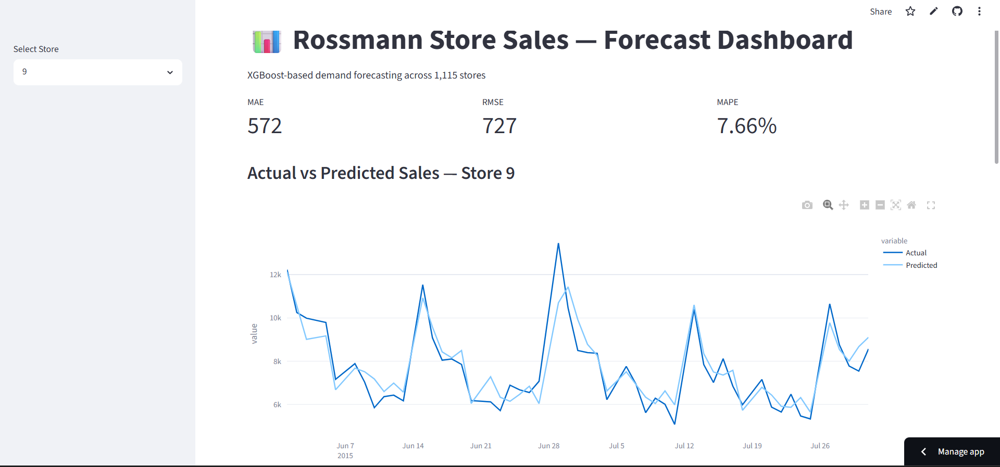
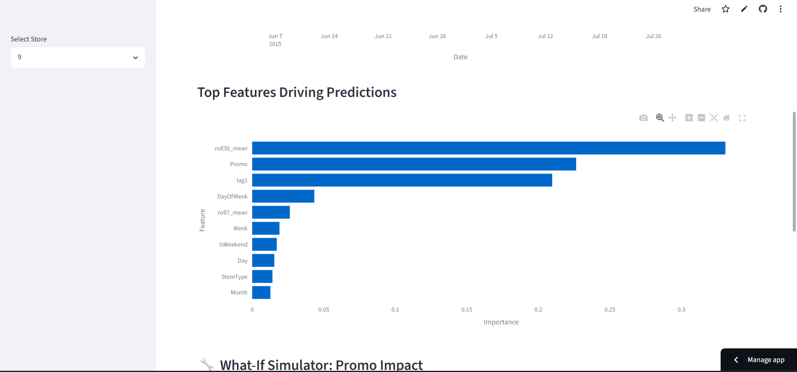

# Retail Sales Forecasting: SARIMA, Prophet, XGBoost & LSTM Comparison

Time series sales forecasting comparing four modeling approaches — **SARIMA**, **Prophet**, **XGBoost**, and **LSTM** — to predict daily store-level sales.

🔗 **Live demo:** https://salesforecasting-9utmq3gxb92dj97tkadpae.streamlit.app




---

## Problem

Retail chains need to forecast daily sales 6 weeks in advance to plan staffing and inventory. This project works with daily sales across 1,115 stores, along with store metadata (type, assortment, competition distance) and promotional calendars.

## Approach

**1. Data Cleaning & EDA**
- Removed closed-store records (zero sales, not true business signal)
- Handled missing values in `CompetitionDistance`, `Promo2SinceWeek/Year`, `PromoInterval`

**2. Feature Engineering**
- Calendar features: `Day`, `Week`, `Month`, `IsWeekend`, `IsHoliday`
- Lag features: `lag1`, `lag7`, `lag14`, `lag30`
- Rolling statistics: `roll7_mean`, `roll30_mean`
- Store attributes: `StoreType`, `Assortment`, `Promo`, `Promo2`

**3. Stationarity Testing**
- ADF and KPSS tests run together (rather than relying on either alone) to confirm differencing requirements before fitting SARIMA

**4. Model Comparison**

| Model | Scope | MAE | RMSE | MAPE |
|---|---|---|---|---|
| SARIMA | Single store (Store 1) | 612.14 | 719.39 | 15.06% |
| Prophet | Single store (Store 1) | 681.08 | 761.48 | 15.55% |
| XGBoost | Single store (Store 1) | 251.50 | 303.95 | 5.82% |
| XGBoost | All stores | 622.62 | 868.85 | 9.49% |
| LSTM | All stores | 374.19 | 475.17 | 8.56% |

**Key takeaways:**
- XGBoost with lag/rolling features substantially outperforms classical time series models (SARIMA, Prophet) at the single-store level, since it can directly exploit promo and calendar signals that ARIMA-family models don't capture well.
- At single-store scale, XGBoost's error is lowest; scaling to all 1,115 stores naturally raises error (more variance to generalize across), where LSTM partially closes the gap by learning shared temporal patterns across stores.
- SARIMA and Prophet are included as classical baselines — useful for interpretability and trend/seasonality decomposition, but limited as exogenous regressors (promotions, holidays) become more important than pure autocorrelation.

**5. Feature Importance (XGBoost, all-store model)**

| Feature | Importance |
|---|---|
| `roll30_mean` | 0.331 |
| `Promo` | 0.226 |
| `lag1` | 0.210 |
| `DayOfWeek` | 0.043 |
| `roll7_mean` | 0.026 |

30-day rolling average and promotional activity dominate — recent sales momentum and promo flags carry far more signal than calendar position alone.

## Repository Structure

```
├── time_series.ipynb          # Full pipeline: EDA → feature engineering → modeling → evaluation
├── xgb_model.pkl              # Trained XGBoost model (all-store)
├── val_predictions.csv        # Validation set: actual vs. predicted
├── future_predictions.csv     # 6-week forward forecast (test set)
├── feature_importance.csv     # XGBoost feature importances
├── latest_store_features.csv  # Most recent feature snapshot per store (used for inference)
├── app.py                     # Streamlit interface
└── requirements.txt
```

## Tech Stack

`pandas` · `numpy` · `statsmodels` (SARIMA) · `prophet` · `xgboost` · `tensorflow/keras` (LSTM) · `scikit-learn` · `matplotlib` / `seaborn`

## Data

[Retail store sales dataset](https://www.kaggle.com/datasets/chakramlops/rossmann-store-sales-dataset) (Kaggle) — 1,115 stores, ~2.5 years of daily sales history, with store metadata and promotional calendars.
